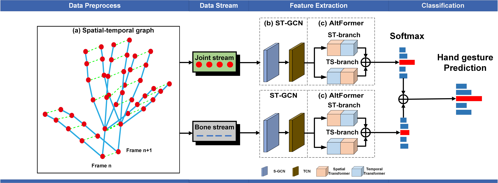

# ST-GCN-AltFormer:Gesture Recognition with Spatial-Temporal Alternating Transformer

This repository holds the Pytorch implementation of [ST-GCN-AltFormer:Gesture Recognition with Spatial-Temporal Alternating Transformer] Qing Pan, Jintao Zhu, Lingwei Zhang, Gangmin Ning, and Luping Fang.

## Introduction

We propose a Spatial-Temporal Alternating Transformer (AltFormer) method for hand gesture recognition. The key idea is that the present approaches have limitations in capturing the information conveyed in the synergistic actions of non-adjacent graph nodes, and their long-range dependencies.  The code of training our approach for skeleton-based hand gesture recognition on the [DHG-14/28 Dataset](http://www-rech.telecom-lille.fr/DHGdataset/), the [SHREC’17 Track Dataset](http://www-rech.telecom-lille.fr/shrec2017-hand/) and the [LMDHG Dataset](https://www-intuidoc.irisa.fr/english-leap-motion-dynamic-hand-gesture-lmdhg-database/) are provided in this repository.
<p align="center"></p>

### Prerequisites

This package has the following requirements:

* `Python 3.8`
* `Pytorch v2.0.1`

### Training
1. Download the [DHG-14/28 Dataset](http://www-rech.telecom-lille.fr/DHGdataset/) , the [SHREC’17 Track Dataset](http://www-rech.telecom-lille.fr/shrec2017-hand/) and [LMDHG Dataset](https://www-intuidoc.irisa.fr/english-leap-motion-dynamic-hand-gesture-lmdhg-database/).

2. Run one of following commands.
```
python SHREC/ST_TS/train_sttran.py       # on SHREC’17 Track Dataset
python LMDHG/ST_TS/LMDHG_sttran.py         # on LMDHG Dataset
python DHG/ST_TS/DHG_sttran.py        # on DHG Dataset


3. if you need weighting parameter(.pth), please download from Google Cloud Drive：https://drive.google.com/file/d/1BVXWKuMRgqca4v5DujPjHuCycqfp503D/view?usp=drive_link

4. Finally，run esemble.py or emsemble_LMDHG.py
